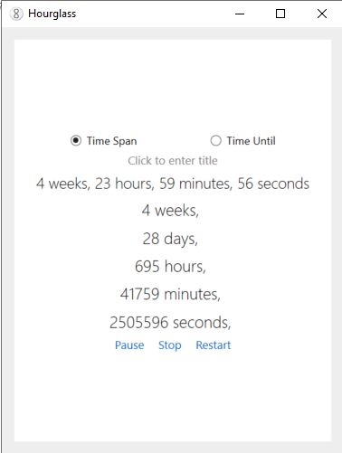

# Hourglass

**Hourglass** is a simple countdown timer desktop application for Windows. It allows users to start timers using input time span or specific time in the future.

## 🛠 Tech Stack

- **Language:** C#
- **Framework:** .NET Framework 4.8
- **UI:** Windows Forms (WinForms)